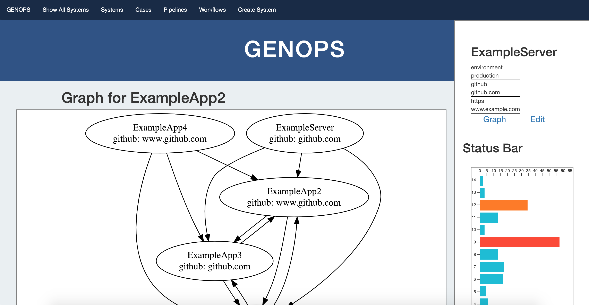

# Genops System Management

#### Molecular Genomics Lab: Internship Project 2018

#### Eric Shull 


<hr />

## Description

 A dashboard app created in Rails for monitoring all applications used in molecular genomics lab. Graphviz and D3 are used to create graphs showing visual associations between all applications in the Rails app. System Nodes are linked to themselves through a System Links join table. System Nodes have many Settings to keep track of configurations for each app in the network.
<hr />
## Setup/Contribution Requirements

1. Clone the repo
1. From the root of the repo run the following commands:
```
rake db:create
```
1. Populate the database
```
rake db:migrate
```
1. run the application
```
rails s
```
1. Copy and paste the localhost file from the command prompt into your browser's url
```
localhost:3000
```
<hr />

## Technologies Used

* Ruby 2.5.0
* Rails 5.2.1
* GraphViz
* D3

<hr />

## User Stories

- As a user I want to: create new system nodes
- As a user I want to: make connections between system nodes
- As a user I want to: add configurations to a system node

<hr />

## License

This software is licensed under the MIT license.

Copyright (c)2018 **Eric Shull**